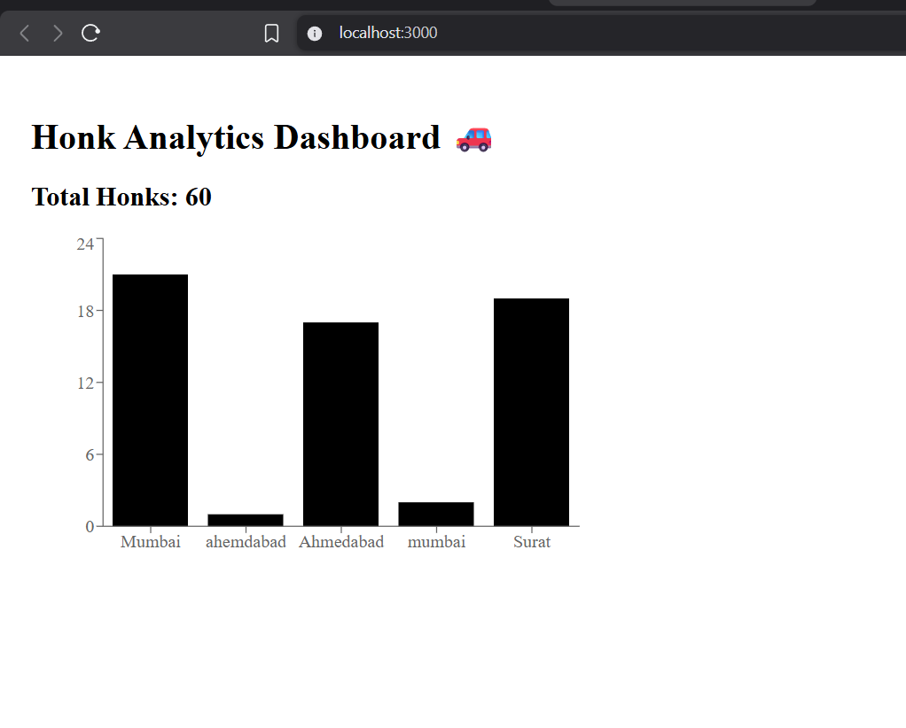

# 🚗 Honk Analytics System

A full-stack web application that simulates an IoT-based vehicle honking data system and provides analytics through a dashboard.

---

## 📌 Overview

This project simulates how IoT devices installed in vehicles send honking data to a backend server. The system stores the data and provides real-time analytics such as total honks and location-based distribution.

---

## 🚀 Features

- 📡 Collects honk data via REST API
- 🗄️ Stores data in MongoDB
- 📊 Provides analytics:
  - Total honk count
  - Honks by location
- 📈 Visual dashboard using charts
- 🔄 Simulates real-time IoT data (auto-generated entries)

---

## 🛠️ Tech Stack

### Backend
- Node.js
- Express.js
- MongoDB
- Mongoose

### Frontend
- React.js
- Axios
- Recharts

---

## ⚙️ Installation & Setup

### 1️⃣ Clone the repository

```bash
git clone https://github.com/RaviKumarSah07/honk-analytics.git
cd honk-analytics

Honk-Analytics-System/
├── backend/
│   ├── models/
│   │   └── Honk.js                      ← Mongoose schema
│   ├── controllers/
│   │   └── analyticsController.js       ← All 3 API handlers
│   ├── routes/
│   │   └── analyticsRoutes.js           ← Route definitions
│   └── seedData.js                      ← One-time seed script
│
└── frontend/src/
    ├── hooks/
    │   └── useFetch.js                  ← Reusable data-fetching hook
    ├── components/
    │   ├── StatCard.jsx + .css          ← Metric cards
    │   ├── ChartCard.jsx + .css         ← Chart wrapper
    │   └── LoadingSpinner.jsx + .css    ← Loading state
    └── pages/
        └── AhmedabadDashboard.jsx + .css ← Main dashboard page